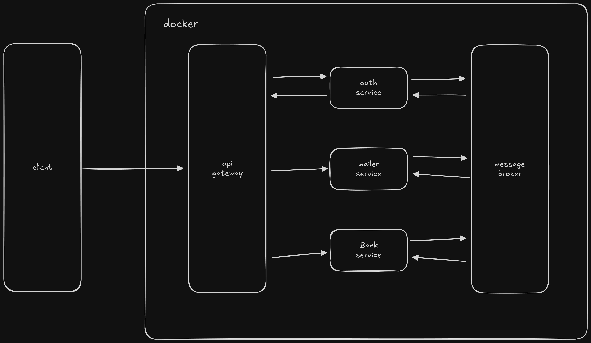

# MiniBank – Sistema Bancário Distribuído

**MiniBank** é uma aplicação demonstrativa construída com arquitetura de microserviços para simular operações bancárias básicas. O projeto foi desenvolvido com foco em boas práticas de engenharia de software, mensageria assíncrona, escalabilidade, testes automatizados e integração com serviços externos.

## Sumário

* [1. Arquitetura](#arquitetura)
* [2. Funcionalidades](#funcionalidades)
* [3. Tecnologias](#tecnologias)
* [4. Como Executar o Projeto](#como-executar-o-projeto)
* [5. Estrutura de Diretórios](#estrutura-de-diretórios)
* [6. Considerações Finais](#considerações-finais)

## Arquitetura



A aplicação é composta por múltiplos microserviços independentes:

* **Auth Service**: Gerencia autenticação e usuários.
* **Bank Service**: Gerencia contas bancárias e transações.
* **Mailer Service**: Responsável pelo envio de e-mails transacionais.
* **API Gateway**: Roteamento centralizado utilizando Ocelot.

## Funcionalidades

* Comunicação entre microserviços via **RabbitMQ**
* Separação clara de responsabilidades por serviço
* Publicação e consumo de eventos assíncronos
* Envio de e-mails (simulado)
* Integração com **PostgreSQL** via **EF Core**
* Registro de logs estruturados com **Serilog**
* Testes de unidade com **xUnit**
* Preparado para ambientes em nuvem (AWS-ready)
* Suporte a **CI/CD** com **GitHub Actions**

## Tecnologias

* **.NET 8**
* **Entity Framework Core**
* **PostgreSQL**
* **RabbitMQ**
* **Redis** (Caching)
* **Docker & Docker Compose**
* **Ocelot** (API Gateway)
* **Serilog** (Logging estruturado)
* **xUnit** (Testes automatizados)
* **GitHub Actions** (Integração Contínua e Deploy)

## Como Executar o Projeto

### Pré-requisitos

* [.NET 8 SDK](https://dotnet.microsoft.com/download)
* [Docker](https://www.docker.com/)
* [Docker Compose](https://docs.docker.com/compose/)
* [PostgreSQL](https://www.postgresql.org/)

### 1. Clonar o Repositório

```bash
git clone https://github.com/wesleybertipaglia/MiniBank.git
cd MiniBank
```

### 2. Subir a Infraestrutura com Docker Compose

```bash
docker compose up -d
```

Esse comando inicia o **RabbitMQ** e os bancos de dados **PostgreSQL** usados pelos serviços.

### 3. Executar os Microserviços

Cada microserviço possui sua própria *solution*, organizada em camadas. Para rodar todos os serviços:

```bash
dotnet build
dotnet run --project src/MiniBank.Auth/MiniBank.Auth.API
dotnet run --project src/MiniBank.Bank/MiniBank.Bank.API
dotnet run --project src/MiniBank.Mailer/MiniBank.Mailer.API
dotnet run --project src/MiniBank.ApiGateway/MiniBank.ApiGateway.API
```

### 4. Acessar o Sistema

* **API Gateway**: [http://localhost:5010](http://localhost:5010)
* **Swagger UI** por serviço:

  * Auth: [http://localhost:5020/swagger](http://localhost:5020/swagger)
  * Bank: [http://localhost:5030/swagger](http://localhost:5030/swagger)
  * Mailer: [http://localhost:5040/swagger](http://localhost:5040/swagger)
* **RabbitMQ Management**: [http://localhost:15672](http://localhost:15672)
  (Usuário: `guest` / Senha: `guest`)

### 5. Executar os Testes

```bash
dotnet test
```

## Estrutura de Diretórios

```
src/
├── MiniBank.Auth/
│   ├── MiniBank.Auth.API/
│   ├── MiniBank.Auth.Application/
│   ├── MiniBank.Auth.Core/
│   ├── MiniBank.Auth.Infrastructure/
│   └── MiniBank.Auth.Tests/
├── MiniBank.Bank/
│   ├── MiniBank.Bank.API/
│   ├── MiniBank.Bank.Application/
│   ├── MiniBank.Bank.Core/
│   ├── MiniBank.Bank.Infrastructure/
│   └── MiniBank.Bank.Tests/
├── MiniBank.Mailer/
│   ├── MiniBank.Mailer.API/
│   ├── MiniBank.Mailer.Application/
│   ├── MiniBank.Mailer.Infrastructure/
│   └── MiniBank.Mailer.Tests/
├── MiniBank.ApiGateway/
│   └── MiniBank.ApiGateway.API/
docker-compose.yml
LICENSE
MiniBank.sln
README.md
```

## Considerações Finais

Este projeto foi desenvolvido com o objetivo de demonstrar conhecimentos práticos em:

* Arquitetura de sistemas distribuídos
* Mensageria assíncrona
* Logging estruturado
* Testes automatizados
* Integração e entrega contínua (CI/CD)
* Boas práticas de desenvolvimento com **.NET**

O foco principal não é entregar um produto pronto para produção, mas sim evidenciar habilidades técnicas e domínio de uma arquitetura moderna baseada em microserviços.
